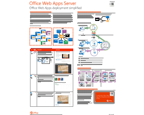

---
title: Office Web Apps サーバーのコンテンツ ロードマップ
TOCTitle: 'コンテンツ ロードマップ: Office Web Apps サーバー'
ms:assetid: ddf27b4b-c4fc-4ca7-8248-1fd3730b6f3e
ms:mtpsurl: https://technet.microsoft.com/ja-jp/library/Dn135237(v=office.15)
ms:contentKeyID: 56631544
ms.date: 12/18/2017
mtps_version: v=office.15
ms.translationtype: HT
---

# Office Web Apps サーバーのコンテンツ ロードマップ

 

_<strong>適用先:</strong>Office Web Apps, Office Web Apps Server_

_<strong>トピックの最終更新日:</strong>2016-12-16_

**概要:** IT 担当者が Office Web Apps サーバーを展開および管理するために役立つ記事、ダウンロード プログラム、その他のリソースへのガイドを提供します。

**対象ユーザー:** IT 担当者

.gif "IT 担当者向けのコンテンツ ロードマップ (バナー イメージ)")

Office Web Apps サーバー は、ブラウザー ベースのバージョンの Word、PowerPoint、Excel、およびOneNote を提供する新しい Office サーバー製品です。SharePoint 2010 製品 は Office Web Apps サーバー をサポートしていません。

Outlook Web App についての情報をお探しの IT 担当者の方 は、「[Exchange 2013 での Outlook Web App の新機能](http://go.microsoft.com/fwlink/?linkid=282325) 」を参照してください。

> [!IMPORTANT]
> これは、Office Web Apps サーバー を自分たちの組織に展開および管理する、管理者に向けた記事です。 <STRONG>デスクトップやモバイル デバイス上の Office Web Apps についてお困りですか?</STRONG> 詳細については、「<A href="http://go.microsoft.com/fwlink/p/?linkid=269811">Office 365 で Office Web Apps の使用を開始する</A>」を参照してください。

次の表は、 Office Web Apps サーバーを展開および管理する IT 担当者に提供できるリソースを示します。

### IT プロフェッショナルのための Office Web Apps サーバーのロードマップ

<table>
<colgroup>
<col style="width: 33%" />
<col style="width: 33%" />
<col style="width: 33%" />
</colgroup>
<tbody>
<tr class="odd">
<td>

</td>
<td>
<strong>ここから開始</strong>
</td>
<td>
SharePoint 2013、Lync Server 2013、Exchange Server 2013 を展開したい、またはカスタム ソリューションを持っていて Office Web Apps を入手したい場合、詳細については、「<a href="http://go.microsoft.com/fwlink/p/?linkid=294929">Office Web Apps の概要 英</a>」を参照してください。<a href="office-web-apps-server-overview.md">Office Web Apps サーバー</a> は、Office ファイルに対して、表示サービスや編集サービスを提供するブラウザー ベースのOffice です。Office Web Apps サーバー は 、<a href="http://go.microsoft.com/fwlink/p/?linkid=299202">Web アプリ オープン プラットフォーム インターフェイス プロトコル (WOPI)</a>をサポートする製品およびサービスと共に動作します。ホストとして知られるこれらの製品には、<a href="office-web-apps-server-overview.md">SharePoint 2013</a>、<a href="office-web-apps-server-overview.md">Lync Server 2013</a>、<a href="office-web-apps-server-overview.md">Exchange Server 2013</a> があります。Office Web Apps サーバー についてのハイレベルな概要iおよび機能については、 「<a href="http://go.microsoft.com/fwlink/p/?linkid=299305">Office Web Apps サーバーのポスター</a>」を参照してください。

<strong>Office Web アプリケーション サーバーのポスター</strong>

 

ユーザーは、Office Web Apps サーバー によって <a href="office-web-apps-server-overview.md">オンライン ビューアーを使用して web サイトや共有フォルダーに Office ファイルを表示する</a>こともできます。

 

組織内に複数の Excel エキスパート ユーザーとビジネス インティジェンス ソリューションをお持ちの場合は、どちらを有効にするか決めるため、<a href="how-office-web-apps-work-on-premises-with-sharepoint-2013.md">Excel Web App と Excel Services の相違点</a>について参照してください。

 

Office Web Apps は、Windows Phone、iPhone、iPad、Windows 8 タブレット、および Android デバイスなどの <a href="how-office-web-apps-work-on-premises-with-sharepoint-2013.md">多くのデバイス</a> 上で使用できます。

 

Office Web Apps サーバー を使用する SharePoint 2013 を構成している場合、ユーザーはWord、PowerPoint、Excel、および OneNote Web Apps 内のドキュメントを <a href="https://technet.microsoft.com/ja-jp/library/ff718249(v=office.15)">共同編集</a>できます。

 

Office Web Apps サーバー を展開して SharePoint 2013 と共用する方法については、 <a href="video-configure-office-web-apps-for-sharepoint-2013.md">ビデオ: SharePoint 2013 の Office Web アプリケーションを構成します。</a>」をご覧ください。.
</td>
</tr>
<tr class="even">
<td></td>
<td>
<strong>Office Web Apps サーバー を計画する</strong>
</td>
<td>
Office Web Apps サーバーを展開する前に、<a href="plan-office-web-apps-server.md">Office Web Apps サーバーの計画</a>することを確認するようにします。.

 

ソフトウェア要件

 

<ul>
<li>
<a href="plan-office-web-apps-server.md">ソフトウェア、ハードウェア、および Office Web Apps サーバーの構成要件</a> および <a href="https://technet.microsoft.com/ja-jp/ff718249(office.15)#bkmk_sw_version_req">SharePoint 2013 および SharePoint Onlineで共同編集するための、ソフトウェアのバージョン要件</a>について学びます。
</li>
<li>
ユーザーが英語以外の言語でドキュメントを表示する必要がある場合は、<a href="plan-office-web-apps-server.md">Office Web Apps サーバーへの言語パックのダウンロードおよびインストール を計画します</a>。
</li>
</ul>

 

ハードウェア、トポロジ、およびネットワークの計画

<ul>
<li>
マイクロソフト IT は、200,000 ユーザーをサポートできる <a href="plan-office-web-apps-server.md">トポロジ</a>を使用して、Office Web Apps サーバー を展開しています。<a href="plan-office-web-apps-server.md">トポロジのガイドライン</a>によると、マイクロソフトのパフォーマンス テストに基づき、Office Web Apps サーバー は 2 基の Intel Xeon プロセッサ (8 コア)、8 GB の RAM、および 60 GB のハード ディスクとでは、ほとんどの使用が見られる場所において最大 10,000 ユーザー をサポートします。16 コアの CPU と 16 GB の RAM を持つサーバーは、最大 20,000 ユーザーをサポートする必要があります。 これらの結果は、使用パターン、およびネットワーク ハードウェアなどの他の要因によって異なります。
</li>
<li>
HTTPS の使用、ハードウェア ロード バランサーに対する SSL オフロードの使用 、OU メンバーシップに基づいた Office Web Apps サーバー ファームへの接続可能サーバーの制限、または 許可一覧 を使用して Office Web Apps サーバーへのホスト アクセスを制限することで、<a href="plan-office-web-apps-server.md">Office Web Apps サーバーのコミュニケーションを安全にする</a> ことができます。
</li>
<li>
Office Web Apps サーバー は独自のサーバー インスタンスを必要とし、SharePoint 2013 のような他のサービスまたはアプリケーションと共用できません。ハードウェアに制限がある場合は、<a href="plan-office-web-apps-server.md">Office Web Apps サーバーを仮想化</a> することができます。
</li>
<li>
2 つ以上のサーバーで Office Web Apps サーバー を実行するときは、<a href="plan-office-web-apps-server.md">負荷分散ソリューション</a>をお勧めします。 ロード バランサーを使用する場合は、ロード バランサーの証明書をインストールする必要があります。 Office Web Apps サーバー で使用する証明書は、 <a href="plan-office-web-apps-server.md">これらの要件を満たす</a>必要があります。
</li>
<li>
<a href="plan-office-web-apps-server.md">Office Web Apps サーバーに対するファイアウォール要件を確認</a>して、Web ブラウザー、Office Web Apps サーバー を実行するサーバー、SharePoint 2013 を実行するサーバー間のコミュニケーションをブロックしているファイアウォールによって起こる問題を防ぎます。
</li>
</ul>

 

ソフトウェアの更新の計画

<ul>
<li>
Office Web Apps サーバー を展開する前に、Office Web Apps サーバー に対して、<a href="plan-office-web-apps-server.md">組織がソフトウェアの更新を管理する方法を計画</a>します。Microsoft 自動更新プロセスは、 Office Web Apps サーバー の更新に適用しません。
</li>
</ul>

 

SharePoint の計画

<ul>
<li>
SharePoint 2013 と共用するために Office Web Apps サーバーを展開する場合は、<a href="plan-office-web-apps-used-with-sharepoint-2013.md">SharePoint 2013 で使用するときに Office Web Appsを計画します</a>.
</li>
<li>
Office Web Apps 用の<a href="https://technet.microsoft.com/ja-jp/library/cc263526(v=office.15)">ブラウザーのサポート</a>は、SharePoint 2013 用と同じです。
</li>
<li>
Office Web Apps は <a href="plan-office-web-apps-used-with-sharepoint-2013.md">クレーム ベース認証</a>SharePoint 2013 を使用する Web アプリケーションによってのみ使用できます。
</li>
<li>
Office Web Apps でのファイル表示は無料ですが、Office Web Apps サーバー を内部設置型で SharePoint 2013 と共用するときに、<a href="https://docs.microsoft.com/en-us/powershell/module/officewebapps/new-officewebappsfarm?view=officewebapps-ps">Office Web Apps の編集を有効にする</a>場合は、<a href="plan-office-web-apps-used-with-sharepoint-2013.md">編集ライセンスを購入する</a>必要があります。
</li>
</ul>

 

他のホストを計画します。

<ul>
<li>
Exchange Server 2013を Office Web Apps サーバーのホストとして使用する場合、 「<a href="http://go.microsoft.com/fwlink/p/?linkid=256611">統合の構成を計画する</a>」を参照してください。
</li>
<li>
Lync Server 2013を使用する場合は、<a href="http://go.microsoft.com/fwlink/p/?linkid=256902">Lync Server 2013 と Office Web Apps サーバーの統合の構成</a>」を計画します。
</li>
</ul></td>
</tr>
<tr class="odd">
<td>

</td>
<td>
<strong>SharePoint 2010 では、Office Web Apps からの移行</strong>
</td>
<td>
SharePoint 2010 製品 を使用していて、SharePoint 2013 への移行を計画していますか? 残念ながら、SharePoint 2010 製品 はOffice Web Apps サーバー をホストできず、Office Web Apps は SharePoint 2013 に更新後に利用できなくなります。 <a href="plan-office-web-apps-used-with-sharepoint-2013.md">SharePoint の認証要件について必ずお読みください。</a>SharePoint 2010 でクラシック モード認証を使用する場合は、<a href="https://technet.microsoft.com/ja-jp/library/gg251985(v=office.15)">クラシック モードからクレーム ベース認証への移行をする必要があります。</a>

 

大きい変更点の1つは、Office Web Apps は SharePoint 2013 を実行するサーバーにはインストールされないことです。<a href="what’s-new-with-office-web-apps-when-used-with-sharepoint-2013.md">SharePoint 2013 製品と使用される場合の Office Web Apps のその他の機能について</a>
</td>
</tr>
<tr class="even">
<td>

</td>
<td>
<strong>WOPI のカスタム ソリューション</strong>
</td>
<td>
カスタム ソリューションがあり、それをOffice Web Apps のホストとして使用したい場合は、<a href="http://go.microsoft.com/fwlink/p/?linkid=294933">カスタム WOPI ホストの作成方法</a>

</td>
</tr>
<tr class="odd">
<td></td>
<td>
<strong>Office Web Apps サーバーを展開する</strong>
</td>
<td>
まず <a href="deploy-office-web-apps-server.md">Office Web Apps サーバーを実行するサーバーを準備します</a>。次に <a href="deploy-office-web-apps-server.md">Office Web Apps サーバーをインストールします</a>。そして最新の Office Web Apps サーバー 更新プログラムを適用します。その後<a href="deploy-office-web-apps-server.md">Office Web アプリケーション サーバーに言語パックをインストールします</a>。

 

Office Web Apps サーバー の機能を評価するには、<a href="deploy-office-web-apps-server.md">単一サーバーの Office Web Apps サーバー ファームをテスト環境で展開します</a>。あるいは、展開をより安全なものにするには、<a href="deploy-office-web-apps-server.md#singlehttps">HTTPS を使用する単一サーバー Office Web Apps Server ファームの展開</a>も可能です。 多くのユーザーのサポートが必要な場合は、<a href="deploy-office-web-apps-server.md#multihttps">HTTPS を使用する負荷分散された複数サーバー Office Web Apps Server ファームの展開</a>もできます。

 

Office Web Apps サーバー を展開した後は、ホストを構成する必要があります。Office Web Apps サーバー を使用するには、「<a href="configure-office-web-apps-for-sharepoint-2013.md">SharePoint 2013 の構成</a>」、「<a href="http://go.microsoft.com/fwlink/p/?linkid=256611">Exchange Server 2013 の構成</a>」および 「<a href="http://go.microsoft.com/fwlink/p/?linkid=256902">Lync Server 2013 の構成</a>」を参照してください。.

 

SharePoint 2013 と共用するOffice Web Apps サーバー の展開に含まれるものについては、「<a href="video-configure-office-web-apps-for-sharepoint-2013.md">ビデオ: SharePoint 2013 の Office Web アプリケーションを構成します。</a>」をご覧ください。
</td>
</tr>
<tr class="even">
<td></td>
<td>
<strong>Office Web Apps を使用する</strong>
</td>
<td>
まず、ユーザーに、これらのリソースをご覧ください。

<ul>
<li>
<a href="http://go.microsoft.com/fwlink/p/?linkid=272447">Excel Web App での基本的な作業</a>
</li>
<li>
<a href="http://go.microsoft.com/fwlink/p/?linkid=272448">OneNote Web App の基本的な作業</a>
</li>
<li>
<a href="http://go.microsoft.com/fwlink/p/?linkid=272449">PowerPoint Web App の基本的な作業</a>
</li>
<li>
<a href="http://go.microsoft.com/fwlink/p/?linkid=272446">Word Web App の基本的な作業</a>
</li>
</ul></td>
</tr>
<tr class="odd">
<td></td>
<td>
<strong>Office Web Apps サーバーを管理する</strong>
</td>
<td>
Office Web Apps サーバー ファームの<a href="plan-office-web-apps-server.md">更新プログラム プロセスの計画と確立を行います</a>。Office Web Apps サーバー 更新プログラムは <a href="apply-software-updates-to-office-web-apps-server.md">指定の方法で適用する必要があります</a>。

 

Office Web Apps サーバー の最新の更新プログラムの一覧は、「<a href="http://go.microsoft.com/fwlink/p/?linkid=280269">Microsoft Office の更新プログラム ブログ</a>」および「<a href="http://go.microsoft.com/fwlink/p/?linkid=280271">Office、Office Servers、および関連製品の Update Center</a>」で確認できます。

 

SharePoint 2013 と共用するためにOffice Web Apps サーバー を展開した場合、既定では、 Office ドキュメントはブラウザーで開かれます。しかし、<a href="set-the-default-open-behavior-for-browser-enabled-documents-office-web-apps-when-used-with-sharepoint-2013.md">この動作を変更してクライアントで Office ドキュメントを開くこと</a>ができます。

 

組織において、ブラウザーでワークブックを表示するために Excel Web App ではなく Excel Servicesを使用することにした場合、 Excel ワークブックの Excel Web App を Windows PowerShell コマンドレット<a href="https://docs.microsoft.com/en-us/powershell/module/sharepoint-server/New-SPWOPISuppressionSetting?view=sharepoint-ps">New-SPWOPISuppressionSetting</a> を使用してオフにすることができます。

 

<a href="configure-office-web-apps-for-sharepoint-2013.md">Office Web Apps サーバーから SharePoint 2013 を切断</a>したい場合は、 Windows PowerShell コマンドレット <a href="https://docs.microsoft.com/en-us/powershell/module/sharepoint-server/Remove-SPWOPIBinding?view=sharepoint-ps">Remove-SPWOPIBinding</a> を使用します。
</td>
</tr>
<tr class="even">
<td></td>
<td>
<strong>Office Web Apps サーバーのトラブルシューティング</strong>
</td>
<td>
<a href="configure-office-web-apps-for-sharepoint-2013.md">SharePoint 2013 と共に使用している Office Web Apps のエラーのトラブルシューティング</a>
</td>
</tr>
<tr class="odd">
<td></td>
<td>
<strong>参照情報</strong>
</td>
<td>
Windows PowerShell コマンドと他の種類の情報についてのリンクをここに示します。

 

Office Web Apps サーバー

<ul>
<li>
<a href="https://docs.microsoft.com/en-us/powershell/module/officewebapps/?view=officewebapps-ps">Office Web Apps サーバーで使用できる Windows PowerShell</a>
</li>
</ul>

 

SharePoint 2013

<ul>
<li>
<a href="https://docs.microsoft.com/en-us/powershell/module/sharepoint-server/?view=sharepoint-ps">Office Web Apps で使用できる Windows PowerShell (SharePoint 2013)</a>
</li>
</ul></td>
</tr>
<tr class="even">
<td></td>
<td>
<strong>ダウンロード</strong>
</td>
<td>
Office Web Apps サーバーに関連するダウンロード :

<ul>
<li>
<a href="deploy-office-web-apps-server.md">Windows Server 2008 R2 ソフトウェアの前提条件</a> のダウンロード
</li>
<li>
<a href="https://www.microsoft.com/licensing/servicecenter/default.aspx">ボリューム ライセンス サービス センター (VLSC)</a>から Office Web Apps サーバー をダウンロードします。Office Web Apps サーバー をダウンロードするには、Office Professional Plus 2013、Office Standard 2013、または Office for Mac 2011 のための、ボリューム ライセンス条項に従ったライセンスが必要です。ダウンロード ファイルは、VLCS ポータルにおいて、それら Office 製品の下にあります。
</li>
<li>
Office Web Apps サーバー <a href="http://go.microsoft.com/fwlink/p/?linkid=263945">言語パック</a> のダウンロード
</li>
<li>
Office Web Apps サーバー 更新プログラムです。 最新版は「<a href="http://go.microsoft.com/fwlink/p/?linkid=280269">Microsoft Office 更新プログラム ブログ</a>」 および「<a href="http://go.microsoft.com/fwlink/p/?linkid=280271">Office、Office サーバー、および関連製品の TechNet Update center</a>」で確認できます。
</li>
<li>
<a href="http://go.microsoft.com/fwlink/p/?linkid=299305">Office Web アプリケーション サーバーのポスター</a> のダウンロード
</li>
</ul></td>
</tr>
<tr class="odd">
<td></td>
<td>
<strong>ビデオ</strong>
</td>
<td><ul>
<li>
<a href="video-configure-office-web-apps-for-sharepoint-2013.md">ビデオ: SharePoint 2013 の Office Web アプリケーションを構成します。</a>
</li>
</ul></td>
</tr>
<tr class="even">
<td>

</td>
<td>
<strong>質問とフィードバック</strong>
</td>
<td>
Office Web Apps サーバー の展開と管理の方法について質問がある場合は、TechNet の <a href="http://go.microsoft.com/fwlink/p/?linkid=259426">Office 2013 および Office 365 ProPlus - 計画、展開、互換性フォーラム</a>に質問を投稿できます。
</td>
</tr>
</tbody>
</table>

## 関連項目

[Office 365 ProPlus の展開のためのスタート ガイド](https://technet.microsoft.com/ja-jp/library/jj839718\(v=office.15\))  
[Office 2013 の ID、認証、承認のロードマップ](https://technet.microsoft.com/ja-jp/library/dn151329\(v=office.15\))  
[Office 2013 のセキュリティのガイド](https://technet.microsoft.com/ja-jp/library/dn194021\(v=office.15\))

